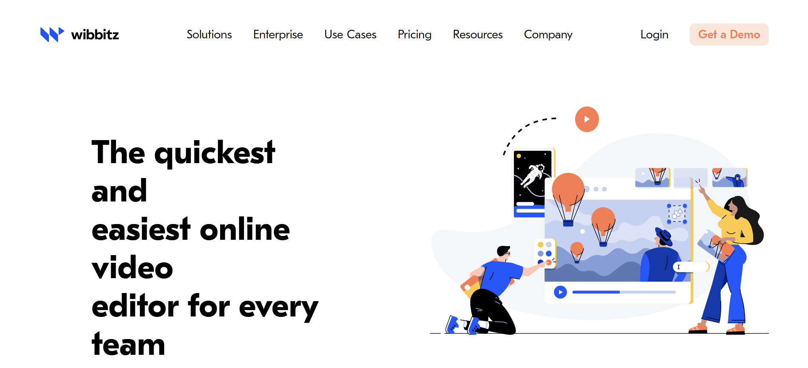

# Wibbitz Static Website Clone

This project is a static clone of the Wibbitz website built using only **HTML** and **CSS**. It replicates the basic structure and design of the Wibbitz homepage for learning and practice purposes.

## 📌 Project Features

- Static website layout
- Structured using semantic HTML5 elements
- Styled using custom CSS
- Multiple sections: Hero, Features, Testimonials, Footer, and more
- Mimics the Wibbitz brand style

## 🚫 Limitations

- ❌ Not responsive (Does not adapt to mobile or tablet screens)
- ❌ No JavaScript functionality
- ❌ Not optimized for accessibility

## 📸 Preview

## 💻 Tech Stack

- HTML5
- CSS3
